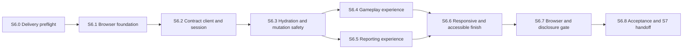

# S6 web application construction plan

Date: 2026-09-21. Objective: build the accessible React/Vite browser client
for the accepted daily-case gameplay, profile, and leaderboard flows without
duplicating the frozen API contract, starting attempts implicitly, or exposing
server-only case content in browser artifacts.

## Readiness decision

S6.0 is **complete**. S6.1 may begin from the reviewed S5 merge after the
2026-09-21 preflight evidence below. No S6.1 dependency or application change
was made during preflight.

The S6 branch is `web-ui`. Its reviewed S5 base is the `main` merge commit for
PR #6, `b8c408961d831beada66004bd30fc124204b2e13`; merge commit `265f22e` joins
that base into the branch without changing the PR head tree.

Repository facts rechecked on 2026-09-21:

- `apps/web` is only a TypeScript scaffold; it has no React, Vite, browser test,
  or runtime dependency yet.
- `@loremaster/contracts` is the machine-checkable browser boundary and exports
  all operation metadata, strict response schemas, error codes, retry policy,
  cookie policy, and public projection types needed by the client.
- The frozen `/api/v1` surface covers session bootstrap, current case, owned
  attempt, commands, suggestions, profile, and paginated leaderboard data.
- S6 owns the real browser refresh journey (T03), UTC slot rollover journey
  (T22), hostile-text inert rendering, and browser bundle/source-map disclosure
  proof. S8 retains deployed-artifact and scheduled closed-slot evidence.
- `ops/build-contexts/web-public.allowlist` already excludes the database,
  importer, authored fixture, and historical source document from a future
  public-web build context.

## Scope and fixed invariants

S6 owns the browser application, typed HTTP adapter, session bootstrapping,
safe mutation retry/reconciliation, responsive gameplay presentation, profile
and leaderboard views, accessibility, browser automation, and compiled-artifact
confidentiality evidence.

The following are fixed inputs, not product choices:

- Use React and Vite as accepted in ADR 0001. PostgreSQL/API state remains
  authoritative; no browser-only state may decide gameplay outcomes.
- Import request/response schemas, public types, status mappings, and retry
  policy from `@loremaster/contracts`. Do not create handwritten wire types.
- Use credentialed same-origin-style requests to the configured `/api/v1`
  origin. The client may read only the non-HttpOnly CSRF cookie and must never
  expose or attempt to read the session cookie.
- Reading or prefetching the current case must not start an attempt. The player
  starts explicitly from the `NOT_STARTED` view.
- Every logical start or gameplay command gets one idempotency key. An uncertain
  500/503/504/transport result retains that key and exact payload until the
  command is replayed or authoritative state is reconciled. A retry must never
  silently generate a second key.
- A stale-version conflict refreshes the owned attempt before the player may
  intentionally submit a new command with a new key. Only one mutation is in
  flight per attempt in a browser context.
- Guess submission requires a canonical suggestion selection; free text is
  never converted into an entity ID. Wrong feedback stays generic.
- Server timestamps and `closesAt` drive displayed availability. The browser
  clock may schedule a refresh but never authoritatively accept a late action.
- Render all names, roles, briefing, evidence, explanations, source references,
  pseudonyms, and error text as plain text. No raw HTML or remote content fetch.
- ACTIVE UI and its compiled assets must not contain answers, future evidence,
  explanations, internal source references, importer code, or authored fixture
  modules. Source maps are subject to the same scan as JavaScript assets.
- Guest identity is unrecoverable. The UI must not promise accounts, cross-device
  continuity, offline play, or permanent hosting.

S6 does not own Redis/BullMQ, cache warming, containers, Kubernetes, deployed
artifact scans, observability retention, or cloud infrastructure. Those remain
S7-S12 work.

## Product states

The application has one persistent shell with Current Case, Profile, and Daily
Leaderboard destinations. Current Case is driven entirely by the frozen
projection discriminator:

| Projection/state                   | Browser presentation and permitted actions                                                                                                    |
| ---------------------------------- | --------------------------------------------------------------------------------------------------------------------------------------------- |
| Session initializing               | Non-destructive loading state; no gameplay controls                                                                                           |
| `NO_CASE`                          | Honest no-case message and UTC refresh guidance; no timer or start                                                                            |
| `NOT_STARTED`                      | Slot window and explicit Start action; no briefing clock yet                                                                                  |
| `ACTIVE`                           | Briefing, evidence `1..e`, counters, prior guesses, canonical entity selection, Guess, Reveal when `e < 4`, and Give Up                       |
| `SOLVED`                           | Success summary, answer, all evidence/explanations/sources, profile link, and slot leaderboard                                                |
| `GIVEN_UP`, `EXHAUSTED`, `EXPIRED` | Clear terminal reason plus the unsealed solution and reporting links                                                                          |
| Recoverable read failure           | Retry action that does not mutate state                                                                                                       |
| Uncertain mutation                 | Block new actions; retry the exact pending operation or reconcile the owned attempt                                                           |
| Session expired                    | Explain identity loss, clear only client-owned pending data, and require an explicit new guest session decision when an attempt could be lost |

Destructive terminal actions such as Give Up require confirmation. Reveal states
its consequence but does not claim participation. Timers are informational,
announce only meaningful thresholds, and never update an ARIA live region every
second.

## Dependency graph

S6.4 and S6.5 may proceed in parallel only after the shared application state
and API client interfaces in S6.3 are frozen. S6.7 exercises the composed app,
not isolated mocks alone.

## Execution matrix

| Slice | Risk     | Primary review                         | Parallel group  |
| ----- | -------- | -------------------------------------- | --------------- |
| S6.0  | Medium   | Delivery review                        | Preflight only  |
| S6.1  | Medium   | TypeScript/build review                | Foundation      |
| S6.2  | High     | TypeScript and security review         | Client boundary |
| S6.3  | Critical | State-machine and security review      | Serial gate     |
| S6.4  | High     | Accessibility and product review       | P1 with S6.5    |
| S6.5  | Medium   | Accessibility and contract review      | P1 with S6.4    |
| S6.6  | High     | Accessibility and responsive UI review | Composition     |
| S6.7  | Critical | Independent E2E/security review        | Serial gate     |
| S6.8  | High     | Independent acceptance review          | Serial exit     |

## S6.0 - Close the delivery preflight

Context: web work must begin from one reviewed API contract and a reproducible
toolchain, not from an unreviewed topic branch by accident.

- Resolve S5 independent review and clean-checkout CI, then base the S6 branch
  on the reviewed S5 merge. Record the base commit and branch in this plan.
- Run the pinned Node 22.17.0/pnpm 11.19.0 install and existing root/database/API
  gates before changing web dependencies.
- Confirm the frozen contract schemas parse representative serialized API
  responses and that the local API accepts `http://localhost:5173`.
- Inventory runtime/test dependency licenses and vulnerabilities before and after
  the S6 dependency change.

Verify: frozen install, `pnpm run verify`, `pnpm test:database`,
`pnpm test:api:database`, dependency audit, secret scan, and `git diff --check`.
Exit: one reviewed S5 base is named and all pre-existing gates pass. Rollback:
discard only the S6 branch/tooling work; do not rewrite S5 history.

Primary files: this plan and delivery evidence only.

### S6.0 preflight evidence (2026-09-21)

Decision: **PASS**. The named S5 base is reviewed and every pre-existing gate
passes. S6.1 remains outside this preflight change.

- Base and review: GitHub records PR #6 as merged from `api-transport` into
  `main` on 2026-09-15 at
  `b8c408961d831beada66004bd30fc124204b2e13`, with all three CI checks passing.
  GitHub records no formal reviewer approval; the independent delivery review
  was therefore completed in this S6.0 preflight against the merge tree, S5
  acceptance record, frozen contract, and current gates. The merge tree is
  identical to reviewed PR head `f66e563b9a362feeecb84d9adae31555e83261a1`.
- Toolchain and install: Node `22.17.0` matches `.nvmrc`, `.node-version`, and
  `engines.node`; Corepack selected pnpm `11.19.0`, matching `packageManager`
  and `engines.pnpm`; `corepack pnpm install --frozen-lockfile` passed with the
  lockfile unchanged. A stale machine-wide pnpm shim was not used; a temporary
  Corepack shim exposed the pinned pnpm to scripts that invoke `pnpm`.
- Existing gates: `pnpm run verify` passed; `pnpm test:database` passed 59/59
  tests; `pnpm test:api:database` passed 7/7 tests; `git diff --check` passed.
  PR #6's clean-checkout CI also passed its Quality, Dependency audit, and
  Secret scan jobs.
- Frozen browser boundary: the contract suite parses representative serialized
  success, error, current-case, attempt, command, profile, suggestion, and
  leaderboard responses. The configured local origin is exactly
  `http://localhost:5173`; config, CORS/auth-policy, kernel, and composed
  HTTP/PostgreSQL tests accept it while rejecting missing, mismatched, or
  repeated mutation origins. This matches `CORS_POLICY`'s
  `EXACT_CONFIGURED_ORIGIN` and credentialed, non-wildcard contract.
- Dependency baseline: `pnpm audit --audit-level moderate` reported no known
  vulnerabilities. The installed pre-S6 graph contains 245 unique third-party
  package/version pairs: 204 MIT, 15 Apache-2.0, 14 ISC, 6 BSD-2-Clause,
  3 BSD-3-Clause, 2 MPL-2.0, and 1 BlueOak-1.0.0; none lacked a declared
  license. Repeat both audit and license inventory after S6 dependencies change.

## S6.1 - Establish the browser foundation

Context: turn the scaffold into the smallest production build and test surface
that later slices can extend without coupling views to transport details.

- Add pinned React, React DOM, Vite, and their required TypeScript integration.
  Add Vitest browser/component support and Playwright only where used by a named
  verification command; avoid a broad UI framework dependency.
- Replace the scaffold entry with a Vite HTML entry, React root, semantic app
  shell, error boundary, route/view state, and CSS foundation. Prefer native
  landmarks, links, buttons, forms, dialogs, and tables.
- Keep the build-time public configuration minimal: an API base path/origin with
  strict URL validation and no secrets. Local development must proxy or target
  the S5 API without weakening its exact Origin/CORS policy.
- Add deterministic `dev`, `build`, `preview`, `typecheck`, component-test, and
  E2E command surfaces. Vite output is the only public artifact root.
- Add dependency/boundary tests proving web source cannot import API, database,
  importer, fixture, server config, or historical content modules.

Verify: focused shell tests, web typecheck/build, root gates, dependency audit,
and public import-boundary scan. Exit: the empty shell runs and builds with no
gameplay behavior or private content. Rollback: remove only S6 web dependencies
and scaffold changes.

Primary files: `apps/web/package.json`, `apps/web/index.html`,
`apps/web/vite.config.ts`, `apps/web/tsconfig*.json`, `apps/web/src/main.tsx`,
shell/styles, and focused web boundary tests.

### S6.1 foundation evidence (2026-09-21)

Decision: **PASS**. The TypeScript scaffold is now the smallest browser build
and test surface required for later S6 slices; it contains no gameplay or API
transport behavior.

- Tooling: React and React DOM `19.3.0`, Vite `8.3.0`, the React plugin `6.1.1`,
  Playwright `1.63.0`, and the Vitest browser adapter `5.0.0` are exact pins.
  The adapter matches the repository's Vitest `5.0.0`; peer checks pass and no
  broad UI framework was added.
- Browser shell: Vite owns the sole `apps/web/dist` public root. React mounts a
  semantic, responsive Current Case/Profile/Daily Ledger shell behind an error
  boundary and URL-backed view state. The original archive styling uses the
  supplied visual references for hierarchy and teal/gold contrast without
  copying their art or introducing third-party assets.
- Configuration boundary: the only public variable is
  `VITE_API_BASE_URL`. It accepts exactly `/api/v1`, a secure absolute API base,
  or a loopback HTTP base for local development; credentials, queries,
  fragments, ambiguous paths, and insecure remote HTTP are rejected. Vite's
  local `/api` proxy preserves the browser Origin and accepts only an exact
  loopback target.
- Named verification: web typecheck/build passed; 31 focused workspace tests,
  2 Chromium component tests, and the Chromium route/refresh E2E journey passed.
  Desktop `1280x720` and mobile `390x844` renderings were inspected against the
  references. The full non-database suite passed 242/242 tests, every workspace
  typecheck/build passed, and formatting, lint, peer, and diff checks passed.
- Disclosure and dependencies: source-boundary tests reject server/private
  imports and content markers. A post-build bundle/source-map smoke scan found
  no server module or private narrative markers; final disclosure proof remains
  assigned to S6.7. The moderate dependency audit reported no known
  vulnerabilities. The installed graph contains 279 unique third-party
  package/version pairs (235 MIT, 18 Apache-2.0, 14 ISC, 6 BSD-2-Clause,
  3 BSD-3-Clause, 2 MPL-2.0, and 1 BlueOak-1.0.0); none lacked a license.

## S6.2 - Build the contract-driven API client and session bootstrap

Context: all views need one validated transport boundary with explicit session,
cookie, error, abort, and retry semantics.

- Implement a small fetch adapter keyed by `API_OPERATIONS`; construct paths and
  queries centrally, send credentials, and validate every success/error payload
  with the exported Zod schemas before application code sees it.
- Map network, malformed-response, public API error, cancellation, and rate-limit
  outcomes into a closed client error model. Preserve public request IDs for
  support display without showing arbitrary server or browser exception text.
- On startup, check `GET /session`; bootstrap with exact `{}` only after a 401 or
  on an explicit new-session action. Read the mode-appropriate CSRF cookie using
  exported cookie policy, and never persist or log its value.
- Centralize operation-aware retry decisions from `API_RETRY_POLICY`. Reads may
  back off; 429 observes `Retry-After`; mutations expose exact-key replay rather
  than generic automatic retries.
- Test credentials, headers, CSRF lookup, abort behavior, schema rejection,
  no-body logging, 401 bootstrap, 429 delay metadata, and every stable error-code
  presentation category.

Verify: focused client/session tests with Mock Service Worker or an equivalently
bounded fetch harness, web typecheck/build, and root gates. Exit: callers receive
only validated public data and cannot accidentally issue an unsafe mutation
retry. Rollback: remove the adapter while retaining the browser scaffold.

Primary files: `apps/web/src/api/*`, `apps/web/src/session/*`, and focused tests.

### S6.2 client/session evidence (2026-09-22)

Decision: **PASS**. Browser callers now cross one contract-derived transport
boundary, and startup restores an existing guest before creating a replacement
session only for a validated authentication-required response or an explicit
new-session action.

- Contract boundary: the client is keyed by `API_OPERATIONS`, infers request and
  response types from its exported schemas, validates path/query/body inputs,
  and accepts a response only when its status, JSON media type, and strict
  success/error schema agree. Requests use `credentials: include`; paths and
  query strings are built centrally.
- Session security: bootstrap sends exact `{}`. Gameplay mutations read only the
  exported local or production CSRF cookie name at call time, validate the
  token, attach one supplied idempotency key, and neither persist nor expose
  cookie, request-body, or browser exception values.
- Failure and retry safety: cancellation, transport failure, malformed response,
  validated public errors, and rate limiting map to a closed client error model.
  Only validated public request IDs are retained. `Retry-After` is accepted as a
  bounded integer delay. Contract retry policy drives read backoff and explicit
  mutation replay/refresh/new-key directives; the automatic retry entry point is
  restricted to GET operations at both type and runtime boundaries.
- Verification: 15 focused client/session tests passed, including credentials,
  headers, CSRF lookup, aborts, schema rejection, sanitized observation events,
  401 bootstrap, 429 delay metadata, and every stable error presentation
  category. `pnpm run verify` passed with 257/257 non-database tests, all
  workspace typechecks/builds, lint, and formatting. The retained Chromium
  component suite passed 2/2 and the shell refresh E2E passed 1/1. The moderate
  dependency audit reported no known vulnerabilities; the only dependency
  addition is the existing `@loremaster/contracts` workspace package.

## S6.3 - Implement hydration, pending-command recovery, refresh, and rollover

Context: navigation, reload, timeout, and midnight must not reset an attempt or
turn one player intention into two mutations.

- Build an application controller/query layer that hydrates session and current
  case, follows returned attempt IDs, deduplicates reads, aborts obsolete reads,
  and accepts only the newest relevant response.
- Generate cryptographically random idempotency keys. Persist one bounded pending
  operation record per guest browser context containing operation kind, path,
  exact request body, key, and creation time; never store cookies, CSRF values,
  response bodies, narrative text, or answers.
- Before allowing another mutation, replay an unresolved pending operation with
  the same key/payload or refresh the owned attempt and reconcile by version and
  resulting projection. Clear a pending record only after a validated definitive
  response or an explicit safe reconciliation rule.
- On `STALE_VERSION`, refresh the owned attempt and require a fresh player action.
  On terminal/no-case/session-loss outcomes, cancel irrelevant in-flight work and
  make identity-loss consequences explicit.
- Schedule a current-case refresh at `closesAt`, and refresh on focus/visibility
  recovery. Prove that old attempts remain displayed by their immutable revision
  while the Current Case entry moves to the new UTC slot.
- Keep URL/history state non-authoritative: reload reconstructs from the API and
  pending-operation record, never from cached projections.

Verify: deterministic state tests for rapid navigation, out-of-order reads,
reload during ACTIVE play, timeout then same-key replay, stale version, terminal
reconciliation, session expiry, focus refresh, and UTC rollover. Exit: T03/T22
behavior and same-intention mutation safety pass below the UI. Rollback: remove
the controller/pending store without changing the API contract.

Primary files: `apps/web/src/state/*`, `apps/web/src/api/idempotency.ts`,
`apps/web/src/api/pending-operation.ts`, and state tests.

### S6.3 hydration/recovery evidence (2026-09-22)

Decision: **PASS**. The shared controller reconstructs gameplay from validated
session/current-case/owned-attempt reads, serializes mutation intentions before
transmission, and keeps browser navigation, timers, and storage subordinate to
authoritative server projections.

- Hydration and reads: session and current case hydrate independently of URL
  state; attempt projections are followed through the owned-attempt endpoint.
  Equal reads deduplicate, replacement reads abort obsolete work, and generation
  checks prevent late responses from overwriting newer state. Session bootstrap
  is abortable, and an expired identity with a stored intent requires an explicit
  replacement-session decision.
- Mutation recovery: Web Crypto produces contract-valid idempotency keys. One
  strict, 2,048-character-bounded `sessionStorage` record contains only the
  operation kind, exact path/body/key, creation time, and non-narrative slot
  reconciliation fields. Storage succeeds before transmission; failures prevent
  the mutation. Cookies, CSRF values, responses, briefing/evidence, and answers
  are never persisted.
- Replay and reconciliation: unresolved operations block new mutations. Replay
  reuses the exact key and body; stale-version rejection clears the rejected
  record, refreshes the owned attempt, and requires a new player action/key.
  Reconciliation clears a command only when a terminal projection proves its
  exact terminal outcome; a version increase alone is insufficient. Start replay
  first confirms the same target slot so an old intention cannot start a new UTC
  case. Session loss cancels reads and clears client-owned pending state.
- Refresh and rollover: `closesAt` schedules an informational refresh without
  authorizing actions. Focus and visible-state recovery force fresh reads. When
  Current Case advances, the new slot projection replaces only Current Case and
  the old owned attempt remains available by its immutable attempt ID.
- Verification: 18 focused S6.3 state/recovery tests pass for deduplication,
  out-of-order reads, ACTIVE reload, storage failure, same-key replay, stale
  version, conservative terminal reconciliation, session expiry, explicit
  replacement sessions, focus/visibility refresh, and UTC rollover. The full
  non-database suite passes 275/275 tests, retained Chromium component tests pass
  2/2, the shell refresh E2E passes 1/1, and the moderate dependency audit reports
  no known vulnerabilities. No third-party dependency was added.

## S6.4 - Deliver the accessible gameplay experience

Context: implement the complete Current Case path against the state/controller
interfaces, preserving explicit start and canonical guess selection.

- Present `NO_CASE`, `NOT_STARTED`, `ACTIVE`, and terminal projections as
  exhaustive components. Use the server projection for every counter, state,
  enabled action, evidence list, and terminal disclosure.
- Make Start explicit. For ACTIVE play, show briefing, visible evidence in order,
  wrong/total guess counters, guess history resolved against public suggestions,
  and the UTC close time.
- Implement a labeled combobox/listbox that debounces bounded suggestion queries,
  supports keyboard and pointer selection, cancels stale searches, announces the
  result count sparingly, and enables Guess only for a selected entity ID.
- Disable mutation controls while one is pending. Keep wrong feedback generic;
  show replay/reconciliation status without claiming that a timed-out command
  failed. Confirm Give Up and communicate Reveal's effect before submission.
- Terminal views show the answer and exactly four evidence explanations/source
  references as inert text, plus clear distinctions among solved, given up,
  exhausted, and expired outcomes.
- Cover level progression, level-four reveal denial, final exhaustion, correct
  solve, repeated entity selection, keyboard-only play, focus restoration after
  dialogs/errors, and hostile strings that resemble HTML/script/URLs.

Verify: focused component/integration tests plus composed mocked journeys for
T02-T12, T15-T21, and T23 presentation. Exit: the whole game is playable by
keyboard and no UI path invents state or submits free text. Rollback: remove
gameplay components without changing the controller/client.

Primary files: `apps/web/src/gameplay/*` and gameplay tests.

### S6.4 gameplay evidence (2026-09-22)

Decision: **PASS**. Current Case now renders every contract projection and
delegates all gameplay truth, versioning, recovery, and mutation outcomes to the
S6.3 controller.

- Projection-driven play: NO_CASE, NOT_STARTED, ACTIVE, and all four terminal
  outcomes are exhaustive views. Starting remains explicit; ACTIVE briefing,
  ordered evidence, counters, UTC close time, and generic guess history come
  directly from the validated server projection. A refreshed stale projection
  permits a deliberate new action, while in-flight or uncertain mutations block
  every new gameplay mutation.
- Canonical selection: the labeled combobox bounds and debounces searches,
  aborts superseded reads, supports pointer and arrow/Enter selection, announces
  result counts, rejects repeated selections, and cannot submit free text.
  Guess requests contain only the selected entity ID and displayed projection
  version.
- Recovery and accessibility: uncertain results offer exact replay or an
  authoritative check without claiming failure. Safe mutation errors receive
  focus, Give Up uses a keyboard-contained alert dialog with Escape/cancel focus
  restoration, and Reveal states its participation effect. Level four exposes
  no further Reveal action.
- Terminal disclosure: solved, given-up, exhausted, and expired copy remains
  distinct. The answer and exactly four evidence explanations/source-reference
  groups render as inert React text; hostile tag-, handler-, and URL-like values
  create no script, image, link, or remote fetch.
- Verification: 7 focused gameplay Chromium tests plus the 2 retained shell
  component tests pass; the mocked production-build Playwright refresh journey
  passes; the complete non-database suite passes 275/275; all workspace
  TypeScript builds, formatting, lint, the Vite production build, diff checks,
  and the moderate dependency audit pass. The browser journey also exposed and
  fixed the native `fetch` receiver binding that transport mocks could not
  exercise. No dependency or frozen API shape changed.

## S6.5 - Deliver profile and daily leaderboard views

Context: reporting must remain useful without implying client-side score/rank
calculation or exposing cursor internals.

- Render current/longest streak, solved/failed counts, accuracy, and regional
  knowledge from `GET /profile`; explain the participation-day rule concisely.
- Render leaderboard rows in a semantic table/list with competition rank,
  pseudonym, evidence level, wrong guesses, elapsed time, and score exactly as
  returned. Never re-rank or re-sort in the browser.
- Implement append pagination with the opaque `nextCursor`, duplicate-request
  suppression, focus-preserving Load More behavior, empty/loading/error states,
  and slot selection driven by the current projection.
- Refresh reporting after terminal reconciliation without blocking the terminal
  gameplay result. Treat reporting failures as isolated, recoverable reads.
- Test zero-history profile, regional values, exact shared ranks, zero-score
  solved rows, pagination boundaries, retry, and hostile pseudonym text.

Completed 2026-09-22. Reporting now uses isolated, schema-validated reads over
the shared current projection. Profile statistics and exact regional values are
presented with the UTC participation rule; the daily ledger preserves API row
order, competition ranks, zero scores, and opaque cursor paging. Terminal
projections trigger non-blocking profile/ledger refreshes. Focused unit and
Chromium coverage proves empty history, regional precision, shared ranks,
hostile text, pagination boundaries, duplicate suppression, and retry. The
complete web component suite, shell refresh journey, 277-test non-database
suite, formatting, lint, workspace typechecks, production build, and diff check
pass.

Verify: focused reporting tests and schemas, web typecheck/build, and root gates.
Exit: B02-B06 and B08-B10 are faithfully presented without browser recomputation.
Rollback: remove reporting views without changing gameplay state.

Primary files: `apps/web/src/profile/*`, `apps/web/src/leaderboard/*`, and tests.

## S6.6 - Complete responsive design and accessibility

Context: make the composed experience coherent and robust from narrow mobile
widths through desktop, with accessibility treated as behavior rather than a
late visual audit.

- Establish a restrained original-fiction visual direction using CSS and local
  generated primitives only; do not introduce third-party lore assets or remote
  fonts. Ensure all information survives high zoom and narrow layouts.
- Define tokens for color, type, spacing, focus, motion, and status. Meet WCAG
  2.2 AA contrast, visible focus, 44px target guidance, reduced-motion support,
  and non-color status cues.
- Preserve heading/landmark order, skip navigation, descriptive page titles,
  form errors, dialog semantics, focus movement on view changes, and polite live
  announcements only for meaningful async changes.
- Test at representative mobile/desktop widths, 200% zoom, keyboard-only,
  reduced motion, forced colors/high contrast where supported, and with automated
  axe checks. Manually inspect the critical start, active, uncertain-mutation,
  and terminal views.

Completed 2026-09-22. The composed archive interface now uses shared color,
type, spacing, focus, motion, target, and status tokens with explicit narrow
reflow, reduced-motion, and forced-colors behavior. Route changes set descriptive
titles and move focus to main content; combobox errors are programmatically
described; scrollable tables and interactive targets remain keyboard reachable.
Five Playwright journeys pass across 360px mobile, desktop, 200%-zoom-equivalent
reflow, keyboard-only navigation, reduced motion, forced colors, gameplay, and
reporting. Axe reports no serious or critical violations in the named states,
all four critical-state screenshots were manually reviewed, the 11-test
component suite passes, the dependency audit is clean, and the exact root
verification gate passes 277/277 non-database tests plus all builds.

Verify: component accessibility suite, Playwright accessibility/responsive
journeys, screenshots for review, web build, and root gates. Exit: no serious or
critical automated violations and the named manual journeys pass. Rollback:
styles/layout only; semantic behavior remains testable.

Primary files: shared shell/components/styles, accessibility tests, and reviewed
screenshots stored only as test artifacts unless intentionally documented.

## S6.7 - Run the real-browser and disclosure acceptance gate

Context: close the S6-owned evidence against a composed web plus real S5 API and
clean PostgreSQL; mocked component tests are not sufficient.

- Add a stable harness that starts clean PostgreSQL, migrates/imports the original
  Aster Quay pack through the operator boundary, starts API and Vite/preview on
  loopback ports, runs Playwright, and always tears down its own processes/data.
- Prove session bootstrap, explicit start, refresh preservation (T03), canonical
  guess selection, evidence progression, terminal result, profile refresh,
  leaderboard pagination, and UTC revision rollover (T22). Use controlled server
  time/test fixtures rather than waiting for wall-clock midnight.
- Simulate delayed/lost mutation responses and prove reload/retry reuses the exact
  idempotency key without duplicate effects. Prove stale-version and expired
  session UX, plus independent browser-context isolation.
- Inject hostile imported public text and prove it renders inert: no DOM nodes,
  navigation, network fetch, event handler, or script execution is created from
  content values.
- Scan all Vite JavaScript, CSS, HTML, manifest, and source-map outputs for answer
  fields/values, future evidence, explanations, internal sources, fixture/importer
  paths, historical document text, secrets, and disallowed server module names.
  Also enforce the public build-context allowlist.
- Run dependency audit, license review, secret scan, and an independent TypeScript,
  accessibility, and security review. Fix the implementation rather than
  weakening acceptance assertions.

Verify: one stable `test:web:e2e` command, one stable `test:web:disclosure`
command, all database/API gates, `pnpm run verify`, dependency audit, secret
scan, and `git diff --check`. Exit: every S6-owned threat and deferred S5 proof
has executable browser/artifact evidence. Rollback: tests/harness only; failures
must be fixed in their owning slice.

Primary files: `tests/web/*`, web test harness scripts, Playwright configuration,
and build-context/disclosure checks.

## S6.8 - Record S6 acceptance and hand off to S7

Context: close browser claims precisely while keeping cache, deployment, and
cloud work deferred.

- Create `docs/architecture/s6-acceptance.md` mapping T03, T22, B13, hostile-text
  XSS, mutation uncertainty, accessibility, responsive behavior, and reporting
  presentation to exact tests and `PASS`, `PARTIAL`, or `DEFERRED (owner)`.
- Record focused component, accessibility, real-browser, bundle/source-map,
  database/API, dependency, and root-gate results. Missing browser/database
  prerequisites are failures, never silent skips.
- Update architecture, development, threat-model, and root status wording only
  after full gates and independent review pass. Document local API+web startup
  without introducing S8 container instructions early.
- State the S7 handoff: web/API semantics remain stable; cache warming may improve
  disposable read paths but must not change gameplay truth, browser contracts,
  or the replica-local limiter fallback.

Verify: clean checkout, frozen install, web E2E/disclosure commands, database/API
commands, `pnpm run verify`, audit, secret scan, and CI. Exit: S6 claims are
traceable and S7 can proceed without reopening browser correctness. Rollback:
documentation/status only.

Primary files: `docs/architecture/s6-acceptance.md`, architecture/development/
threat-model docs, `README.md`, and this plan's progress/mutation records.

## Review and delivery rules

- Prefer one reviewed PR per numbered slice. S6.4 and S6.5 are the only planned
  parallel implementation slices and must keep their named file ownership.
- Every slice includes focused tests, all previously green gates, a dependency
  boundary check, and a local rollback path before progress is marked.
- TypeScript changes require TypeScript review. Session, cookies, storage,
  idempotency, retry, HTML rendering, and artifact scans require security review.
  Interactive UI requires accessibility review.
- Never edit an applied database migration or change the frozen API shape from
  the web package. A required API change starts with contract-owner review and a
  plan mutation before implementation.
- Do not add service workers, offline mutation queues, analytics, remote fonts,
  or third-party scripts in S6. Each expands the disclosure/retry surface and
  requires separate justification.
- If a slice exceeds one focused review, split it with a suffix and update the
  dependency graph before coding.
- Maintain the mutation log below with date, changed slice/dependency, reason,
  affected acceptance IDs, and reviewer. Never silently reorder work after
  implementation begins.

## Progress

- [x] S6.0 Close the delivery preflight
- [x] S6.1 Establish the browser foundation
- [x] S6.2 Build the contract-driven API client and session bootstrap
- [x] S6.3 Implement hydration, pending-command recovery, refresh, and rollover
- [x] S6.4 Deliver the accessible gameplay experience
- [x] S6.5 Deliver profile and daily leaderboard views
- [x] S6.6 Complete responsive design and accessibility
- [ ] S6.7 Run the real-browser and disclosure acceptance gate
- [ ] S6.8 Record S6 acceptance and hand off to S7

## Plan mutation log

- 2026-09-22 - Executed S6.6: completed tokenized responsive styling, route
  title/focus behavior, associated form errors, forced-colors and reduced-motion
  support, axe-backed accessibility journeys, reviewed test-artifact screenshots,
  and mobile/desktop/high-zoom verification. Added only the pinned Playwright axe
  adapter; no server contract or gameplay rule changed.

- 2026-09-22 - Executed S6.4: composed the controller-backed Current Case UI,
  canonical keyboard/pointer entity selection, mutation recovery and focus
  behavior, terminal solution disclosure, hostile-text coverage, and mocked
  production-browser verification. No server rule, endpoint, contract, or
  third-party dependency changed.

- 2026-09-22 - Executed S6.3: added latest-read coordination, an authoritative
  application controller, cryptographic idempotency keys, bounded pending-intent
  storage, exact replay and conservative reconciliation, abortable hydration,
  focus/visibility refresh, and UTC rollover preservation. No endpoint, domain
  rule, or server projection was changed.

- 2026-09-22 - Executed S6.2: added the schema-derived browser API client,
  closed public error model, contract-policy retry directives, mode-aware CSRF
  lookup, and restore-before-create session bootstrap with focused transport and
  security tests. No frozen endpoint, schema, cookie policy, or retry policy was
  changed.

- 2026-09-21 - Executed S6.1 after the preflight pass: pinned the browser and
  real-browser test dependencies, replaced the web scaffold with the Vite/React
  shell, added strict public configuration and import boundaries, and recorded
  focused, root-gate, audit, license, visual, and artifact-scan evidence.

- 2026-09-16 - Initial S6 plan drafted from the reviewed repository boundaries,
  frozen S5 contract, S4/S5 acceptance deferrals, game rules, threat model, and
  current web scaffold. Mutation-safe retries, T03/T22 browser journeys,
  hostile-text rendering, accessibility, and bundle/source-map disclosure are
  explicit gates. Affected: T03, T22, B02-B06, B08-B10, B13, and the S6-owned
  answer-disclosure/XSS controls. Reviewer: pending.
