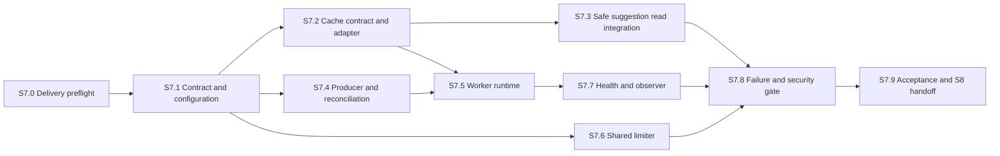

# S7 Redis cache-worker construction plan

Date: 2026-09-24. Objective: add one bounded Redis/BullMQ cache-warming
pipeline for immutable daily suggestion read models, plus a shared abuse
ceiling, without moving gameplay truth, identity, receipts, or synchronous
effects out of PostgreSQL.

## Readiness decision

S7 is **planned but not admitted**. Implementation begins only after S6.8 has a
clean-checkout CI pass and the reviewed `web-ui` branch is merged to `main`.
Record that merge commit as the S7 base before changing dependencies.

The existing `apps/worker`, `apps/queue-observer`, and `packages/queue`
workspaces are compile-only scaffolds. Redis/BullMQ runtime dependencies,
configuration, job contracts, cache repositories, worker lifecycle, and queue
telemetry do not exist yet.

## Fixed invariants and scope

- PostgreSQL remains authoritative for revisions, attempts, commands, receipts,
  sessions, profiles, score, streaks, regional knowledge, and leaderboard.
- No gameplay write waits for Redis or a BullMQ job. A committed PostgreSQL
  transaction is successful even if enqueueing or cache refresh fails.
- S7 adds exactly one job family: `warm-current-revision-v1`. Its deterministic
  job identity is derived from the immutable content revision ID and job
  contract version, never from a secret, guest ID, or unbounded payload.
- The cache may contain a validated server-only immutable suggestion index for
  one published content revision. It accelerates only autocomplete after a
  PostgreSQL transaction has authenticated the guest, proved attempt ownership,
  and returned the immutable revision ID. Current-case reads, owned-attempt
  reads, starts, commands, replay, expiry, and projection hydration stay on the
  PostgreSQL-only path in S7.
- No Redis command may execute between PostgreSQL `BEGIN` and `COMMIT`. Database
  instrumentation and integration tests enforce this for read and write paths.
- Cache keys are versioned, namespaced, length-bounded, and always have TTLs.
  No production path uses `KEYS`, `FLUSHALL`, or an unbounded scan.
- Sessions, CSRF material, idempotency keys, command receipts, attempts,
  per-guest projections, complete HTTP responses, logs, and leaderboard pages
  are not cached in S7.
- Cached content is never returned directly. It is parsed through a strict
  schema and passed through the existing public projection boundary.
- A cache miss, corrupt value, timeout, Redis restart, full memory condition,
  or worker outage falls back to the bounded PostgreSQL path. Invalid cache
  data is ignored; the API falls back immediately and the periodic reconciler
  repairs it later. Only the worker may write or replace hidden-content keys.
- BullMQ is at-least-once. Processors and cache writes are idempotent. Queue
  retries are bounded with jitter, age limits, and finite retention.
- S7 includes a shared Redis limiter that augments the current bounded
  replica-local limiter. Local denial is final; healthy shared denial is final;
  Redis failure uses the local decision and its documented weaker aggregate
  ceiling. The existing public 429 contract remains unchanged.
- The frozen `/api/v1` request/response schemas, cookie/CSRF/idempotency rules,
  status codes, and browser behavior do not change.
- S7 does not own containers, deployed-artifact scanning, Kubernetes,
  long-term telemetry retention, registries, or cloud resources.

## Cache and queue contract

| Item      | Required design                                                                                                       |
| --------- | --------------------------------------------------------------------------------------------------------------------- |
| Job       | `warm-current-revision-v1` with strict versioned schema                                                               |
| Job ID    | Stable hash/version plus immutable revision ID                                                                        |
| Cache key | `loremaster:v1:revision:<revision-id>:suggestions`                                                                    |
| Value     | Schema-versioned canonical JSON; server-only immutable suggestion index                                               |
| TTL       | Fixed bounded TTL longer than one slot but shorter than content retention; exact value frozen in S7.1                 |
| Producer  | Scheduler/bootstrap reconciliation; enqueue failure is observable and non-fatal                                       |
| Consumer  | Worker reads PostgreSQL with importer-inaccessible runtime rights, validates, then atomically replaces the key        |
| Read path | PostgreSQL commits ownership/revision lookup first; cache supplies suggestions only; failure falls back to PostgreSQL |
| Retention | Completed and failed jobs have finite count/age limits; payloads contain no guest or request data                     |

## Dependency graph

S7.2 and S7.4 may proceed in parallel after S7.1 freezes schemas and names.
S7.6 may proceed in parallel with S7.3/S7.5 because it uses a separate client,
ACL user, key namespace, and lifecycle. S7.8 is the serial composition gate.

## Execution matrix

| Slice | Risk     | Primary review                          | Parallel group |
| ----- | -------- | --------------------------------------- | -------------- |
| S7.0  | Medium   | Delivery/dependency review              | Preflight      |
| S7.1  | High     | TypeScript/security architecture        | Contract       |
| S7.2  | Critical | Cache schema/Redis adapter review       | P1             |
| S7.3  | Critical | Transaction/disclosure review           | P2             |
| S7.4  | High     | Queue/idempotency review                | P1             |
| S7.5  | Critical | Worker lifecycle/security review        | P2             |
| S7.6  | Critical | Abuse-control/concurrency review        | P2             |
| S7.7  | Medium   | Health/observability review             | Composition    |
| S7.8  | Critical | Independent integration/security review | Serial gate    |
| S7.9  | High     | Independent acceptance review           | Serial exit    |

## S7.0 - Close the delivery preflight

Context: cache work must start from the reviewed S6 browser/API boundary and a
known clean dependency graph.

- Record the S6 merge commit, branch, hosted CI result, and frozen API contract.
- Run the pinned install, root gates, database/API suites, browser E2E, web
  disclosure scan, dependency audit, license inventory, secret scan, and diff
  hygiene before adding Redis dependencies.
- Confirm Docker can run the pinned Redis test image, but do not add S8 runtime
  container instructions in this slice.
- Inventory current placeholder workspaces and name file ownership for S7.

Verify: all S6 acceptance commands pass from a clean checkout. Exit: one S6
base is named and there are no unexplained baseline failures. Rollback: discard
only S7 planning/preflight changes.

Primary files: this plan and preflight evidence only.

## S7.1 - Freeze queue, cache, and Redis configuration contracts

Context: workers and API replicas need one bounded vocabulary before they can
touch Redis independently.

- Add a server-only `packages/cache` infrastructure package for cache envelopes,
  key construction, Redis ports, and limiter primitives; update the architecture
  boundary explicitly. Keep job contracts/producer/worker glue in
  `packages/queue`. Browser-safe `packages/contracts` must not export either.
- Before adding that package, write and accept
  `docs/adr/0005-server-cache-boundary.md` as the explicit successor to ADR
  0001 for this repository-boundary change. It must justify not coupling
  cache/limiter adapters to `packages/queue`, freeze dependency direction
  (`apps` depend on server-only cache ports; cache never depends on apps or
  browser contracts), and define rollback to PostgreSQL/local limiting.
- Pin compatible BullMQ and one BullMQ-compatible Redis client version; audit
  licenses, vulnerabilities, engine requirements, and reject a second client.
- Define the strict `warm-current-revision-v1` payload/result schemas,
  deterministic job-ID function, queue name, key builder, cache envelope,
  schema version, TTL, retry/backoff, execution timeout, concurrency, and
  completed/failed retention in `packages/queue`.
- Reject unknown fields, unsafe identifiers, oversized payloads, invalid URLs,
  zero/unbounded TTLs, excessive concurrency, and production Redis URLs without
  transport/auth policy required by the accepted deployment profile.
- Freeze separate Redis connection profiles for API cache reads, API limiter,
  producer, worker, and observer: offline queue, retries per request, lazy
  connect, connect/command deadlines, reconnect jitter/cap, shutdown, and client
  ownership. Request-path clients cannot execute a queued command after its
  deadline; worker cancellation propagates to PostgreSQL and Redis operations.
- Freeze Redis ACL users and exact key/command patterns: API can read suggestion
  cache plus access its limiter namespace; producer can enqueue only; worker can
  process queue keys and write exact cache keys; observer has read-only queue
  inspection. Deny broad scan/flush/config/ACL and arbitrary script execution.
- Set quantitative payload, value, key-count, job-count, retention, connection,
  and per-namespace memory budgets with admission headroom under `noeviction`.
- Add separate API/worker/observer configuration parsers and database roles.
- Ensure environment validation never prints Redis credentials.

Verify: `pnpm test:s7:contracts`, `pnpm audit --audit-level moderate`, and
`pnpm run verify`. Exit: all Redis-facing processes import the same immutable contract
and no stringly typed job or key construction remains. Rollback: remove the
dependencies and contract package changes; no runtime path is wired yet.

Primary files: `docs/adr/0005-server-cache-boundary.md`, `packages/queue/*`, new
`packages/cache/*`, `packages/config/*`, focused contract/config tests,
architecture boundary, and lockfile.

## S7.2 - Implement the suggestion-cache contract and Redis adapter

Context: the adapter is server-only infrastructure; it must not decide ownership
or run inside database transactions.

- Define a strict immutable suggestion-index schema keyed only by published
  revision ID. Keep raw rows, authored fixtures, answers, explanations, sources,
  attempts, and guest state outside the envelope.
- Implement bounded get and worker-only atomic set operations with mandatory TTL
  and canonical serialization. The API has no cache write/delete capability.
- Classify miss, corrupt/version mismatch, timeout, reconnect, ACL denial, and
  `noeviction` failure into bounded reason codes without logging value/key text.
- Enforce the client profiles, ACLs, key patterns, and namespace budgets frozen
  in S7.1. Test forbidden commands and wrong-role access.

Verify: `pnpm test:s7:cache` and `pnpm run verify`. Exit: the adapter can only
read/write the declared suggestion envelope through role-specific ports.
Rollback: stop constructing the adapter and cut over to a new namespace version;
old exact keys expire by TTL—no wildcard deletion or scan is required.

Primary files: `packages/cache/src/suggestions/*` and focused cache/ACL tests.

## S7.3 - Integrate the cache after suggestion ownership commits

Context: current `hydrateProjection()` runs inside authoritative transactions.
S7 must not add Redis I/O to that path or to any transaction holding locks.

- Split suggestion lookup into a PostgreSQL authorization phase that verifies
  guest/attempt ownership and returns an immutable revision ID, then commits,
  followed by cache lookup/filtering outside the transaction.
- On cache miss/failure, read the immutable suggestion index from PostgreSQL
  outside the authorization transaction and return the same filtered result.
  The API emits only a bounded miss/corruption signal; it neither enqueues per
  request nor writes hidden-content cache data.
- Leave current-case, owned-attempt, start, command, replay, expiry, and all
  projection hydration code on PostgreSQL-only paths.
- Add transaction-context instrumentation that fails a test if any Redis command
  occurs between `BEGIN` and `COMMIT`.
- Prove two guests with different attempt/evidence state receive only their
  authorized suggestions on hit, miss, corrupt-cache, and Redis-loss paths.

Verify: `pnpm test:s7:suggestions`, `pnpm test:api:database`, and
`pnpm run verify`. Exit: autocomplete is byte-equivalent to S6 and no Redis
command runs in a database transaction. Rollback: select the PostgreSQL-only
suggestion adapter; no public or database contract changes.

Primary files: database suggestion repository/ports, API reporting composition,
transaction instrumentation, and two-guest disclosure tests.

## S7.4 - Add the deterministic producer and recovery reconciliation

Context: the single queued effect warms reconstructible data; it must not become
a hidden prerequisite for case availability.

- Implement one producer for `warm-current-revision-v1` using the shared schema
  and deterministic job ID. Duplicate scheduling coalesces safely.
- Reconcile at startup, on a bounded periodic UTC schedule, and after Redis
  reconnect with single-flight protection. Use server/database time for revision
  selection; never trust a browser clock. Recovery must not require API restart.
- Make producer connection/enqueue deadlines finite. Failure records a bounded
  metric/log and returns; it never fails a gameplay transaction or API startup.
- Bound delayed/retry jobs and remove finite completed/failed history. Custom
  job IDs prevent concurrent queued/active duplicates only while BullMQ retains
  the record; a later re-enqueue is allowed and must be harmless. Freeze and
  test a BullMQ-valid encoded job ID. Do not
  enqueue per request, per guest, or per command.
- Test process restart, duplicate schedule ticks, UTC rollover, missing case,
  and a revision becoming current while Redis is unavailable.

Verify: `pnpm test:s7:producer` covers removal/re-enqueue, multi-replica ticks,
rollover outage, reconnect, and no-restart recovery. Exit: at most one concurrent
queued/active job exists while its deduplication record remains; all repeated
executions are byte-equivalent. Rollback: disable producer/reconciliation;
PostgreSQL suggestions remain live.

Primary files: `packages/queue/src/jobs/*`, API scheduler composition or a
dedicated bounded producer module, and integration tests.

## S7.5 - Build the cache-warming worker runtime

Context: BullMQ delivers at least once, so worker behavior must be idempotent,
bounded, and safe under interruption.

- Replace the worker scaffold with explicit start/stop lifecycle, validated
  configuration, bounded concurrency, job timeout, and signal handling.
- Parse every job before database access. Unknown names/versions and malformed,
  oversized, stale, or poison payloads are permanent non-retryable failures.
  Transient failures have fixed attempt and total-age limits with jitter.
- Read the immutable revision suggestion index from PostgreSQL, validate it, and
  atomically set the exact cache key with TTL. Replaying the same job produces
  the same value and no domain effects.
- On `SIGTERM`, stop accepting new jobs, allow a bounded active job drain, then
  close BullMQ, Redis, and PostgreSQL clients. An interrupted job remains safe
  to retry.
- Keep job logs/metrics free of payload bodies, narrative, answer/source data,
  database parameters, credentials, and high-cardinality identifiers.

Verify: `pnpm test:s7:worker` covers exact poison/transient attempt counts,
cancellation, duplicate, timeout, Redis disconnect, database failure,
mid-write termination, restart, and drain. Exit: worker
loss cannot change or delay gameplay truth. Rollback: scale worker to zero and
let exact namespace keys expire; API falls back to PostgreSQL.

Primary files: `apps/worker/*`, `packages/queue/src/worker/*`, observability
interfaces, and worker integration tests.

## S7.6 - Add the required shared limiter without removing the local fallback

Context: multiple API replicas otherwise permit the sum of local ceilings, but
Redis cannot be allowed to disable abuse protection or allocate unbounded keys.

- Implement an atomic, versioned Redis rate-limit operation with fixed-window
  or sliding-window semantics frozen by tests. Every key has a TTL and bounded
  HMAC-pseudonymized identity input using separate rotatable key material.
- Apply shared ceilings only to the existing operation classes and numeric
  limits. Preserve current response status/headers and do not alter gameplay
  database limits.
- Run the bounded replica-local limiter first on every request. Local denial can
  never be overridden; healthy shared denial also denies; only both allow. On
  Redis timeout/error, use the local decision and expose a bounded degraded-mode
  signal. Freeze deterministic `Retry-After` selection for dual denials.
- Prevent key/cardinality abuse and connection amplification. Never store raw
  cookie, session, CSRF, idempotency, or untrusted forwarding-header values.
- Prove atomic behavior under concurrency and document the aggregate weakness
  during Redis outage.

Verify: `pnpm test:s7:limiter` covers concurrency, expiry, HMAC rotation,
two-replica aggregate, Redis outage/recovery,
spoofed source, capacity, and telemetry-redaction tests. Exit: shared limiting
strengthens the healthy path and never weakens the existing fallback.
Rollback: disable shared limiting while retaining the current local limiter.

Primary files: `packages/cache/src/limiter/*`,
`apps/api/src/security/rate-limit.ts`, server composition, and security tests.

## S7.7 - Implement worker health and the queue observer

Context: operators need bounded health and queue signals before S8 can add
container probes; S10 still owns the complete telemetry stack and retention.

- Give the worker a private minimal health server with process-only liveness,
  PostgreSQL/Redis readiness, and explicit draining state. Freeze its port,
  bind-address policy, timeouts, and response schemas for S8/S9 probes.
- Replace the observer scaffold with read-only BullMQ queue inspection and a
  minimal HTTP runtime exposing liveness, readiness, and metrics.
- Export only allowlisted low-cardinality values: queue name/version, waiting,
  active, delayed, completed/failed counts, oldest bounded age, worker
  connectivity, and degraded state.
- Do not expose job payloads, IDs, stack traces, Redis URLs, keys, guest data,
  revision content, or arbitrary queue labels.
- Add graceful shutdown and strict response schemas. Readiness fails on its own
  Redis dependency; API liveness remains independent.
- Keep metric names stable for S10 and document that S7 retention is only the
  finite BullMQ job retention configured in S7.1.

Verify: `pnpm test:s7:health` and `pnpm test:s7:observer` cover schemas,
cardinality/disclosure, Redis/PG outage, malformed queue data, and drain. Exit:
S8 has probeable worker/queue health without
claiming the S10 observability gate. Rollback: remove observer deployment; queue
processing remains correct.

Primary files: `apps/worker/src/health/*`, `apps/queue-observer/*`,
`packages/observability/*`, and focused health/observer tests.

## S7.8 - Run the composed Redis failure and security gate

Context: isolated mocks cannot prove loss, duplicate delivery, or poison-job
behavior across API, PostgreSQL, Redis, worker, and observer.

- Create a disposable pinned Redis harness with `noeviction`, a small memory
  ceiling, finite persistence settings for testing, and unique test namespace.
- Exercise cold start, warm hit, Redis restart, OOM write rejection, cache
  corruption, duplicate jobs, poison jobs, worker kill/restart, delayed retry,
  UTC rollover, and queue cleanup.
- Compare API responses and PostgreSQL rows with Redis enabled, disabled, and
  restarted. Gameplay outcomes and database effects must be identical. Do not
  use `FLUSHALL`; the isolated harness removes only its exact disposable Redis
  instance.
- Run two API replicas to prove the shared limiter's healthy aggregate ceiling
  and local fallback during Redis loss.
- Exercise role ACL denial, per-namespace memory saturation, reconnect storms,
  poison-job terminal handling, and outage spanning rollover followed by
  recovery without process restart.
- Scan serialized Redis values, BullMQ payloads, logs, and metrics for cookies,
  tokens, request bodies, guest/attempt IDs, and accidental raw HTTP responses.

Verify: `pnpm test:redis`, `pnpm test:s7:integration`, all S6 gates,
audit, license, secret, and diff checks. Exit: all accepted Redis failure modes
degrade to PostgreSQL/local controls without correctness or disclosure change.
Rollback: remove the S7 composition wiring; no schema rollback is required.

Primary files: `scripts/redis-test.mjs`, `tests/queue/*`, `tests/worker/*`,
`tests/api/*redis*`, package scripts, and CI workflow.

## S7.9 - Record acceptance and hand off to S8

Context: S8 needs exact runtime processes, ports, environment variables, probes,
shutdown budgets, and data ownership before assembling containers.

- Create `docs/architecture/s7-acceptance.md` mapping Redis/cache threat controls
  and failure scenarios to executable evidence with `PASS`, `PARTIAL`, or
  `DEFERRED (owner)` status.
- Record exact dependency versions, queue/cache contracts, key/TTL inventory,
  retry/retention limits, connection budgets, ports, health endpoints, signal
  behavior, and degraded-mode semantics.
- Update architecture, threat model, development guide, and README without
  claiming containers or deployed artifacts.
- Run independent TypeScript, database, and security review, then clean-checkout
  hosted CI on the final documentation commit.
- State S8 handoff: package only the accepted processes; preserve explicit
  migration/import operations, PostgreSQL authority, Redis failure fallback,
  private-content boundaries, and the frozen browser/API contract.
- Record local two-guest cache isolation as S7 evidence; S12 repeats that claim
  in the separately admitted AWS/shared-cache environment rather than owning
  the first implementation proof.

Verify: every S7 claim links to a named command/test and hosted CI is green.
Exit: S7 is reproducible from a clean checkout and S8 can containerize it
without inventing runtime behavior. Rollback: documentation/status only.

Primary files: `docs/architecture/s7-acceptance.md`, architecture/threat/developer
docs, README, and this progress checklist.

## Acceptance scenarios owned by S7

| Scenario                       | Required result                                                                      |
| ------------------------------ | ------------------------------------------------------------------------------------ |
| Cache absent or Redis replaced | Same validated API response and PostgreSQL effects; bounded latency degradation only |
| Corrupt or wrong-version cache | Reject value, fall back to PostgreSQL, periodic worker reconciliation repairs later  |
| Redis unavailable/full         | Gameplay and reads remain available through PostgreSQL; local limiter remains active |
| Duplicate/replayed warm job    | One deterministic cache value, no domain or database mutation                        |
| Poison/oversized job           | Rejected without content disclosure or unbounded retry                               |
| Worker killed mid-job          | Retry is safe; partial value is never observed                                       |
| Revision rollover              | New deterministic job/key; old immutable key expires by TTL                          |
| Shared limiter concurrency     | Healthy replicas enforce one atomic shared ceiling                                   |
| Shared limiter outage          | Each replica enforces bounded local ceiling and reports degraded mode                |
| Queue observation              | Low-cardinality health/metrics only; no payload, key, or identity disclosure         |
| Two-guest cache isolation      | Hit/miss/corruption never crosses attempt ownership or evidence state                |
| Transaction boundary           | Instrumentation proves no Redis command occurs between database begin and commit     |

## Slice delivery protocol

Each slice runs on `codex/s7-<slice-name>` from the accepted predecessor commit
and should remain one reviewable PR. Its `Primary files` list is exclusive
ownership unless the plan records a mutation. Every PR runs its named focused
command plus `pnpm run verify`; database/Redis slices also run
`pnpm test:database`, `pnpm test:api:database`, and the latest composed S7 gate.
CI must reproduce the commands from a clean checkout. Record command output,
dependency/audit changes, rollback confirmation, and reviewer in the slice
evidence before merge. Do not begin a dependent slice from an unreviewed tree.

## Progress

- [ ] S7.0 Close the delivery preflight
- [ ] S7.1 Freeze queue, cache, and Redis configuration contracts
- [ ] S7.2 Implement the suggestion-cache contract and Redis adapter
- [ ] S7.3 Integrate the cache after suggestion ownership commits
- [ ] S7.4 Add the deterministic producer and recovery reconciliation
- [ ] S7.5 Build the cache-warming worker runtime
- [ ] S7.6 Add the required shared limiter without removing the local fallback
- [ ] S7.7 Implement worker health and the queue observer
- [ ] S7.8 Run the composed Redis failure and security gate
- [ ] S7.9 Record acceptance and hand off to S8

## Plan mutation protocol

Append dated changes below. State the evidence that invalidated the current
plan, affected scenarios/controls, dependency-edge changes, migration or
rollback impact, and reviewer. Never silently broaden cached data or add a
durable asynchronous effect. Any durable job requires a superseding ADR with a
PostgreSQL outbox and processed-event uniqueness design.
