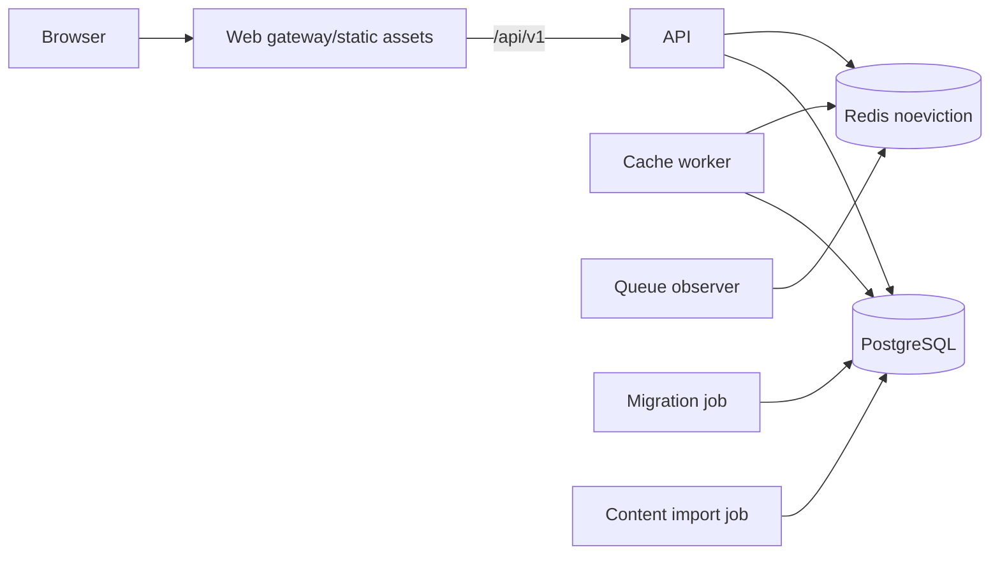
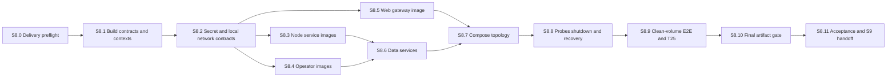

# S8 local container construction plan

Date: 2026-09-24. Objective: assemble the accepted web, API, worker, queue
observer, PostgreSQL, and Redis behavior into reproducible hardened local
containers, then prove the full stack from clean volumes without introducing
Kubernetes, registry, or cloud claims.

## Readiness decision

S8 is **planned but not admitted**. Implementation begins only after S7 has a
reviewed acceptance record, clean-checkout hosted CI, and a merge commit on
`main`. Record that commit as the S8 base.

`deploy/`, `platform/`, and `infra/` currently contain no tracked runtime
implementation. S8 owns `deploy/images`, a local Compose stack, container test
harnesses, and deployed-artifact evidence. S9 owns kind/Helm/Argo CD and
`platform/`; S11-S12 own cloud infrastructure.

## Fixed invariants and scope

- Images package already-accepted application behavior. They do not change the
  frozen `/api/v1` contract, gameplay rules, cookie/CSRF/idempotency semantics,
  cache contract, or PostgreSQL authority.
- Build contexts are explicit allowlists. Repository-root copy is forbidden.
  Historical content, authored fixtures, tests, local state, Git history,
  credentials, environment files, coverage, and unrelated workspaces are not
  present in runtime images.
- Every base image and downloaded build tool is pinned by immutable digest and
  recorded with license/vulnerability evidence. `latest` is forbidden.
- Application containers run as numeric non-root users, drop all capabilities,
  set `no-new-privileges`, use read-only root filesystems where practical, and
  receive bounded CPU/memory/PID/file-descriptor settings.
- Secrets use read-only Compose secret files and mutually exclusive validated
  `*_FILE` application inputs. They never appear in Dockerfiles, resolved
  Compose environment, container inspection output, image layers, labels, build
  arguments, logs, or committed environment files.
- API startup never migrates or imports content. Migration and content import
  remain explicit short-lived operator jobs with distinct credentials.
- PostgreSQL and Redis are not published outside the private backend network in
  the acceptance stack. Only the web gateway is host-accessible by default.
- Redis uses persistence and `noeviction`; loss remains recoverable and cannot
  change gameplay truth. PostgreSQL uses a named volume in development and a
  disposable, exactly named volume in clean-stack tests.
- Liveness never depends on downstream services. Readiness checks only the
  dependencies required for that process. Health commands have strict timeouts
  and cannot mutate state.
- `SIGTERM` drains API requests and worker jobs within fixed budgets shorter
  than the future Kubernetes termination grace period.
- S8 closes deployed web-artifact disclosure and scheduled closed-slot T25
  evidence. S12 still owns shared-cache isolation in the admitted AWS lab.
- Docker Compose is a local integration/development vehicle, not a production
  orchestrator. S8 does not publish images, create a cluster, provision cloud
  resources, or claim production availability.
- The local container profile is fixed at `http://localhost:8080`, API mode
  `local`, and the accepted local cookie names. Production mode remains HTTPS
  only and must reject this HTTP profile.
- The gateway strips inbound forwarding headers and reconstructs client address
  headers. It alone occupies a fixed, isolated edge network address trusted by
  the API as an exact `/32`; no other backend service joins that network.

## Target topology

`web` is the only default published service. API, worker, observer, PostgreSQL,
and Redis communicate on private Compose networks. Migration and import are
explicit profiles/jobs, not long-running dependencies.

## Dependency graph

S8.3, S8.4, and S8.5 may proceed in parallel after their build and secret
contracts are frozen. Remaining slices compose serially because they share
runtime manifests and acceptance state.

## Execution matrix

| Slice | Risk     | Primary review                  | Parallel group |
| ----- | -------- | ------------------------------- | -------------- |
| S8.0  | Medium   | Delivery/dependency review      | Preflight      |
| S8.1  | Critical | Supply-chain/security design    | Foundation     |
| S8.2  | Critical | Secret/network contract review  | Foundation     |
| S8.3  | High     | Node/container security review  | P1             |
| S8.4  | Critical | Database/operator image review  | P1             |
| S8.5  | Critical | Web disclosure/security review  | P1             |
| S8.6  | Critical | Data-service operations review  | Composition    |
| S8.7  | High     | Network/configuration review    | Composition    |
| S8.8  | Critical | Reliability/lifecycle review    | Serial gate    |
| S8.9  | Critical | Independent E2E/security review | Serial gate    |
| S8.10 | Critical | Supply-chain/disclosure review  | Serial gate    |
| S8.11 | High     | Independent acceptance review   | Serial exit    |

## S8.0 - Close the delivery preflight

Context: container work must package a reviewed S7 runtime rather than conceal
application or dependency failures inside images.

- Record the S7 merge commit, acceptance matrix, process inventory, ports,
  environment schemas, health endpoints, shutdown budgets, and data ownership.
- Run all S7 gates on the host with pinned Node/pnpm and disposable
  PostgreSQL/Redis before adding container files.
- Verify Docker Engine/Compose versions and BuildKit behavior supported by the
  developer baseline; freeze the minimum supported versions.
- Inventory candidate base images and scanners by digest, architecture,
  provenance, license, update policy, and known vulnerabilities.

Verify: S7 acceptance is green and one reviewed base is named. Exit: every
process to package has an executable host command and lifecycle contract.
Rollback: discard only S8 planning/preflight work.

Primary files: this plan and preflight evidence only.

## S8.1 - Freeze image, build-context, and supply-chain contracts

Context: narrow contexts and deterministic dependency installation are the
first confidentiality boundary, not a cleanup after images exist.

- Define explicit context allowlists for web, API, worker, observer, migration,
  and importer. Generate or validate contexts from allowlists; do not depend on
  a broad `.dockerignore` as the sole exclusion control.
- Pin Node builder/runtime and web gateway images by digest. Freeze target
  platforms, image names, OCI labels, numeric UID/GID, exposed ports, workdirs,
  and allowed writable paths.
- Use multi-stage builds with `corepack` and `pnpm install --frozen-lockfile`.
  Production stages contain only required compiled output and pruned production
  dependencies for their process.
- Define deterministic timestamp/provenance handling and a repeat-build
  comparison policy. Record acceptable nondeterministic metadata explicitly.
- Add static checks rejecting root users, `latest`, remote unverified downloads,
  secret-like `ARG`/`ENV`, broad `COPY .`, shell-form entrypoints, and package
  installation in final stages.
- Freeze the scanner and policy: no unapproved HIGH/CRITICAL OS or application
  finding. Exceptions require package/CVE, compensating control, owner,
  independent reviewer, and expiry within 30 days. Each image slice runs this
  policy before later composition work begins.

Verify: `pnpm test:s8:image-policy`, dependency audit, and secret scan. Exit:
every future image has a minimal reviewed input set and
runtime contract. Rollback: no images have been admitted yet.

Primary files: `deploy/images/*`, `ops/build-contexts/*`, policy scripts/tests,
and CI configuration.

## S8.2 - Add file-backed secrets and freeze the local edge contract

Context: current API configuration accepts database and HMAC secrets only as
environment values, which are visible through resolved Compose/container
inspection. The HTTP gateway also needs one exact origin and trust boundary.

- Add mutually exclusive `*_FILE` support for database URLs/passwords, cursor
  HMAC material, Redis ACL credentials, and other S7 secrets. Reject simultaneous
  value/file inputs, symlinks, non-regular files, wrong ownership/mode, oversized
  content, NULs, unexpected whitespace, empty values, and unknown variables.
- Read each secret once at startup, keep errors redacted, and test that values do
  not appear in environment/config serialization, logs, metrics, or process
  arguments. Keep direct values only for the existing host-development path.
- Freeze local stack origin `http://localhost:8080`, API mode `local`, local
  cookie names, gateway port, private service ports, and an isolated fixed CIDR.
  Production mode must continue rejecting HTTP and local cookie names.
- Put only gateway and API on the edge network. Assign the gateway one exact
  trusted `/32`; strip all inbound `Forwarded`/`X-Forwarded-*` headers and set
  the accepted source address header once. Test spoof rejection and distinct
  legitimate client addresses.

Verify: `pnpm test:s8:secrets`, `pnpm test:s8:proxy-contract`, and
`pnpm run verify`. Exit: all container secrets are file-backed and local
origin/cookie/proxy behavior is unambiguous. Rollback: container entrypoints are
not wired yet; host environment inputs remain unchanged.

Primary files: `packages/config/*`, API/worker/observer configuration, focused
secret/proxy tests, and container environment contract documentation.

## S8.3 - Build hardened API, worker, and observer images

Context: each Node process needs one purpose-built image and command; a single
large monorepo runtime image would erase ownership and disclosure boundaries.

- Build separate final stages for API, worker, and queue observer, sharing
  reviewed builder stages only where it does not broaden final contents.
- Add a strictly validated listen-address setting so containerized API/observer
  can bind their private interface while local host defaults remain loopback.
- Run with numeric non-root UID/GID, exec-form entrypoints, init/reaping support
  where required, read-only filesystem, and explicit writable `tmpfs` paths.
- Ensure production dependencies resolve without workspace source, TypeScript,
  test runners, package-manager caches, or build tools in final images.
- Test direct signal delivery, exit codes, unhandled rejection behavior, and
  bounded shutdown for every long-running process.

Verify: build each target, inspect user/layers/files/entrypoint, start it with
minimal valid configuration, run `pnpm test:s8:node-images`, generate an SBOM,
and apply the S8.1 vulnerability policy. Exit: each image contains and starts
exactly one accepted runtime responsibility.
Rollback: host commands remain the supported path.

Primary files: service Dockerfiles/targets under `deploy/images`, runtime
configuration, entrypoints, and container policy tests.

## S8.4 - Build migration and content-import operator images

Context: privileged operator actions need isolated images and inputs, not extra
commands or credentials in long-running service images.

- Build separate migration and importer final stages with distinct numeric
  users, entrypoints, dependency sets, contexts, and database credentials.
- Keep migration ownership and importer roles separate. Runtime API/worker
  images must not contain these entrypoints, credentials, authored fixture
  source, or DDL tooling they do not need.
- Accept content only from one read-only mounted file/directory contract outside
  the image. Validate regular-file type, ownership/mode, size, encoding, schema,
  and exact selected path; reject symlinks/traversal and never log content.
- Define success/no-op/failure exit codes and prove rerun behavior. Down
  migrations remain limited to exactly named disposable test databases.

Verify: `pnpm test:s8:operator-images`, image inventory/SBOM/vulnerability
policy, denied runtime DDL/import, invalid mount, and rerun tests. Exit: operator
images perform only their named action. Rollback: retain documented host
migration/import commands.

Primary files: operator Dockerfile targets, entrypoints, read-only input
contract, and operator image tests.

## S8.5 - Build the public web gateway image

Context: the public image is the final S6 disclosure boundary and must serve the
Vite build without exposing server code or weakening browser security.

- Build web assets only from `ops/build-contexts/web-public.allowlist`; keep
  `VITE_API_BASE_URL` at the accepted same-origin `/api/v1` path.
- Serve immutable hashed assets with bounded caching while `index.html` remains
  revalidatable. Preserve SPA route fallback without rewriting `/api`, health,
  or unknown asset paths to HTML.
- Reverse proxy only the exact `/api/` prefix to the private API service.
  Forward the browser's `Origin` header byte-for-byte when present; never create,
  normalize, or rewrite it. The API must continue rejecting missing, repeated,
  or non-`http://localhost:8080` mutation origins. Apply the separate source-IP
  header strip/reconstruction policy and do not expose API to the host by default.
- Add CSP and other static-response headers compatible with the S6 client.
  Disable directory listing, server version disclosure, remote asset fetches,
  and runtime template substitution of secrets.
- Run the gateway non-root on an unprivileged port with read-only root and a
  minimal writable runtime area if the selected server requires it.

Verify: `pnpm test:s8:web-image` covers browser route/refresh/API proxy, cookies,
valid/missing/malicious/repeated Origin behavior, source-IP spoofing, headers,
cache behavior, hostile paths, SBOM/vulnerability policy, an allowlisted
runtime-tool inventory, and recursive image/source-map scan. Exit:
the assembled public image contains only allowlisted public material and serves the
unchanged S6 application. Rollback: use the host Vite preview workflow.

Primary files: web Dockerfile/target, gateway config, public context builder,
and containerized browser/disclosure tests.

## S8.6 - Add PostgreSQL and Redis data-service operations

Context: clean volumes need explicit bootstrap, but runtime services must never
acquire owner/importer privileges or mutate schema on startup.

- Pin PostgreSQL and Redis images by digest. Configure Redis persistence,
  `noeviction`, memory limit, protected networking, health check, and explicit
  data volume.
- Provision development/test login roles through Compose secrets without
  committing credentials. Keep migration owner, importer, API, worker, Redis
  producer, Redis worker, Redis observer, and Redis API identities separate.
- Enforce the S7 Redis ACL command/key matrix and prove wrong-role denials.
- Wire the S8.4 one-shot images as explicit Compose profiles/jobs. They are
  operator-invoked and absent from normal API startup.
- Define forward-only production migration semantics and clean-volume-only down
  behavior. Never auto-run down migrations during teardown.
- Validate volume ownership, restart recovery, PostgreSQL readiness, Redis AOF
  or chosen persistence recovery, and clear failure messages.

Verify: `pnpm test:s8:data-services` covers empty-volume bootstrap, restart with
retained data, denied runtime DDL/import, Redis ACL/persistence/reconstruction,
wrong credentials, and namespace memory pressure.
Exit: data services can be initialized without granting long-running services
operator rights. Rollback: destroy only exactly named disposable test volumes;
developer volumes require explicit operator action.

Primary files: `deploy/compose/*`, operator scripts, `.env.example` containing
placeholders only, and database/Redis container tests.

## S8.7 - Compose the isolated local stack

Context: topology must make intended trust boundaries visible and reproducible
before S9 translates them to Kubernetes resources.

- Compose web, API, worker, observer, PostgreSQL, and Redis with separate public
  and backend networks. Publish only the web gateway by default.
- Use service DNS names internally; reject `localhost` assumptions in
  container-only configuration. Bind host ports to loopback for optional debug
  profiles only.
- Set `no-new-privileges`, drop capabilities, use read-only roots/tmpfs, and use
  supported Compose `cpus`, `mem_limit`, `pids_limit`, `ulimits`, and logging
  rotation fields. Assert effective values through container inspection.
- Express dependency ordering through health/readiness for developer
  convenience but keep application retry/degraded behavior correct if a
  dependency restarts later.
- Provide explicit commands for build, bootstrap, start, status, logs, browser
  test, stop, and safe cleanup. Never suggest broad Docker prune commands.

Verify: `pnpm test:s8:compose` covers config normalization without secret
values, network reachability, effective resource/security inspection, restart
ordering, and a local browser smoke test.
Exit: a fresh developer can run the accepted stack with documented placeholders
and no hidden host services. Rollback: stop the named project without deleting
persistent volumes unless explicitly requested.

Primary files: Compose manifests/profiles, environment examples, scripts, and
`docs/development` container instructions.

## S8.8 - Prove probes, shutdown, restart, and dependency recovery

Context: container success means more than the process remaining alive.

- Add liveness/readiness checks for web, API, worker, observer, PostgreSQL, and
  Redis using accepted semantics and strict command timeouts.
- Prove API liveness remains green while PostgreSQL readiness fails; prove Redis
  loss degrades cache/shared limiting while gameplay continues through
  PostgreSQL and the local limiter.
- Send `SIGTERM` during an API request and during an active warm job. Verify
  bounded drain, correct exit, connection closure, and safe job replay.
- Restart each dependency independently and demonstrate automatic bounded
  recovery without container recreation or gameplay duplication.
- Test disk-full/read-only/OOM-style failure paths where safely simulatable and
  ensure logs stay redacted and bounded.

Verify: `pnpm test:s8:lifecycle` produces machine-readable results. Exit:
future S9 probe and termination values are supported by measurements rather
than guesses. Rollback: revert manifest health/resource tuning; application
behavior remains unchanged.

Primary files: container health commands, lifecycle harness, and operational
evidence under `ops/`.

## S8.9 - Run clean-volume full-stack E2E and close T25

Context: S8 owns proof that packaged components work together from no prior
state and that scheduled observation does not synthesize gameplay effects.

- Create an exactly named, isolated Compose project with new PostgreSQL/Redis
  volumes; build images, migrate, import the approved Aster Quay pack, and start
  the stack using only documented commands.
- Run the S6 real-browser journeys through the web gateway, including refresh,
  rollover, hostile text, mutation uncertainty, profile, and leaderboard.
- Exercise S7 cache/queue failure journeys through containers and compare
  PostgreSQL truth before and after Redis/worker restarts.
- Close T25 with a disposable PostgreSQL test image that adds a pinned,
  reviewed `libfaketime` layer and virtualizes wall-clock time for PostgreSQL
  only. Set fake time a few seconds before UTC midnight, keep monotonic clocks
  real, create a schema-valid 24-hour revision through the normal migration and
  importer path, start the stack, and make no start request. Advance across
  midnight through the test image's bounded timestamp-file control, confirm
  `clock_timestamp()` passed `closes_at`, allow scheduled reconciliation to run,
  then prove no attempt, participation, failure, knowledge, score, streak, or
  receipt was synthesized. The fake-time image/controller and `LD_PRELOAD`
  material are excluded from every runtime context/SBOM; runtime identities
  cannot alter the timestamp file; production images/config have no clock
  override and continue using real PostgreSQL `clock_timestamp()`.
- Run a second guest isolation journey for HTTP/session ownership. Record that
  S12 still owns admitted shared-cache isolation in AWS.
- Tear down the exact test project and its disposable volumes, then verify no
  labeled container/network/volume remains.

Verify: `pnpm test:s8:e2e` fails on any skipped prerequisite or residual
resource. Exit: clean-volume packaged behavior matches accepted host behavior
and T25 is PASS. Rollback: test resources are disposable; no developer volume
is targeted.

Primary files: `scripts/container-e2e.mjs`, `tests/containers/*`, Compose test
profile, and T25 evidence.

## S8.10 - Run final deployed-artifact and supply-chain acceptance

Context: source and Vite-dist scans do not prove what actually shipped in image
layers and runtime filesystems.

- Export/inspect every final image and reproduce its per-image SBOM with the
  pinned scanner. CI admits no unapproved HIGH/CRITICAL finding. A temporary
  exception names package/CVE, compensating control, owner, independent
  reviewer, and expiry no later than 30 days.
- Recursively scan the web image, its layers, manifest/config, source maps, and
  served responses for server modules, authored fixture source, answers, future
  evidence, explanations, internal sources, historical text, credentials, and
  secret-shaped values.
- Scan every image, including the gateway, against an allowlisted runtime-file
  and tool inventory; reject Git history, environment files, test artifacts,
  package caches, compilers, private fixture source, and unexpected shells/tools.
- Verify immutable base references, final user, entrypoint, ports, labels,
  capabilities, writable paths, and build provenance. Rebuild and compare
  declared reproducibility fields.
- Add CI image builds/scans without registry credentials or image publication.
  Preserve read-only untrusted PR permissions.

Verify: `pnpm test:images`, `pnpm test:web:deployed-disclosure`, SBOM,
vulnerability, secret, and policy gates. Exit: B13 deployed-artifact ownership
is PASS with reviewable evidence. Rollback: reject images; host runtime remains
available.

Primary files: image inspection/disclosure scripts, CI workflow, evidence
manifests, and scanner policy.

## S8.11 - Record acceptance and hand off to S9

Context: S9 should translate measured container contracts into Kubernetes/Helm
objects rather than rediscover runtime behavior.

- Create `docs/architecture/s8-acceptance.md` mapping clean-volume, T25, B13,
  lifecycle, security, and supply-chain claims to exact evidence.
- Record image digests, SBOM/scanner results, ports, UIDs, networks, volumes,
  secrets/config inputs, resources, writable paths, probes, shutdown timings,
  operator jobs, and recovery procedures.
- Update architecture, threat model, development guide, and README. Clearly
  state that Compose is local and no registry/Kubernetes/cloud deployment exists.
- Run independent TypeScript, container-security, database, accessibility, and
  delivery review, followed by clean-checkout hosted CI.
- State S9 handoff: preserve image digests and runtime contracts; add kind,
  Helm, Argo CD, policies, and drift/recovery evidence without rebuilding
  application semantics.

Verify: every claim links to a named command/artifact, fresh-clone instructions
pass, and hosted CI is green. Exit: S8 is reproducible from clean volumes and
S9 inputs are explicit. Rollback: documentation/status only; images remain
unpublished local artifacts.

Primary files: `docs/architecture/s8-acceptance.md`, architecture/threat/developer
docs, README, and this progress checklist.

## Acceptance scenarios owned by S8

| Scenario                  | Required result                                                                |
| ------------------------- | ------------------------------------------------------------------------------ |
| Clean-volume bootstrap    | Explicit migrate/import jobs followed by healthy full stack                    |
| Normal startup            | Only web published; private services reachable only on intended networks       |
| PostgreSQL unavailable    | API live but not ready; no false success or migration attempt                  |
| Redis/worker unavailable  | PostgreSQL gameplay remains correct; local limiter remains active              |
| API/worker SIGTERM        | Bounded drain and clean connection closure; no duplicate effect                |
| Dependency restart        | Bounded automatic recovery without gameplay loss                               |
| Browser through gateway   | All S6 critical journeys pass against packaged stack                           |
| T25 closed unstarted slot | No synthetic attempt or profile/participation effect                           |
| Public deployed artifact  | No private/server content in files, layers, maps, config, or responses         |
| Supply chain              | Pinned bases, SBOM, admitted vulnerability result, non-root runtime            |
| Teardown                  | Exact disposable test resources removed; persistent developer data untouched   |
| Secret inspection         | No secret value in resolved Compose, environment, args, layers, or logs        |
| Origin/cookies            | Local HTTP profile works; production mode rejects HTTP                         |
| Forwarded source IP       | Gateway strips spoofed headers; API trusts only exact gateway identity         |
| T25 test control          | Fixture controller is absent from runtime images and unusable by runtime roles |

## Slice delivery protocol

Each slice runs on `codex/s8-<slice-name>` from the accepted predecessor commit
and should remain one reviewable PR. Its `Primary files` list is exclusive
ownership unless a plan mutation records overlap. Every PR runs its named
focused command plus `pnpm run verify`; image/data slices also run the latest
`pnpm test:images`, database, Redis, and composed S8 gates. CI must reproduce the
commands from a clean checkout. Record image digests, SBOM/policy result,
effective security/resource inspection, rollback confirmation, and independent
review before merge. Do not begin a dependent slice from an unreviewed tree.

## Progress

- [ ] S8.0 Close the delivery preflight
- [ ] S8.1 Freeze image, build-context, and supply-chain contracts
- [ ] S8.2 Add file-backed secrets and freeze the local edge contract
- [ ] S8.3 Build hardened API, worker, and observer images
- [ ] S8.4 Build migration and content-import operator images
- [ ] S8.5 Build the public web gateway image
- [ ] S8.6 Add PostgreSQL and Redis data-service operations
- [ ] S8.7 Compose the isolated local stack
- [ ] S8.8 Prove probes, shutdown, restart, and dependency recovery
- [ ] S8.9 Run clean-volume full-stack E2E and close T25
- [ ] S8.10 Run final deployed-artifact and supply-chain acceptance
- [ ] S8.11 Record acceptance and hand off to S9

## Plan mutation protocol

Append dated changes below. State the evidence that invalidated the plan,
affected scenarios/controls, dependency-edge changes, rollback impact, and
reviewer. Never silently broaden build contexts, publish images, weaken
container isolation, auto-run migrations/imports, or introduce Kubernetes/cloud
resources. Those changes require explicit acceptance ownership and, where they
change architecture, a superseding ADR.
